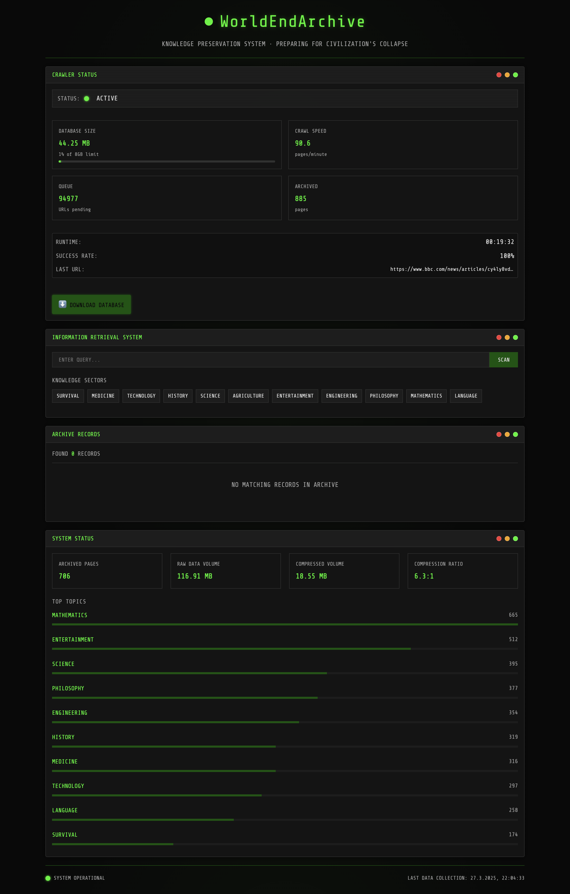

# 🌍 WorldEndArchive

<p align="center">
  
</p>

<div align="center">
  
  
  
  
  
  **A Knowledge Preservation System for When Everything Ends**
  
</div>

## 📋 Table of Contents

- [Overview](#-overview)
- [Features](#-features)
- [Installation](#-installation)
- [Usage](#-usage)
- [Configuration](#-configuration)
- [Architecture](#-architecture)
- [Content Filtering](#-content-filtering)
- [Contributing](#-contributing)
- [Emergency Usage](#-emergency-usage)
- [License](#-license)

## 🔍 Overview

WorldEndArchive is a self-contained web crawler and archiving system designed to preserve human knowledge in case of internet infrastructure collapse or civilization breakdown. It systematically crawls the web, compressing and storing important information into a local SQLite database, which can then be searched and accessed offline.

## ✨ Features

- **📡 Autonomous Web Crawler**: Recursively crawls websites, following links to archive entire knowledge bases
- **⚙️ Automatic Operation**: Starts crawling automatically when the application runs
- **💾 Size Management**: Automatically stops when database reaches 8GB to prevent excessive storage use
- **🧠 Topic Classification**: Categorizes content by topics using keyword analysis
- **🔍 Content Filtering**: Only archives content that matches defined knowledge categories
- **📦 High-Ratio Compression**: Uses LZMA compression to minimize storage requirements
- **🔎 Full-Text Search**: Search archived content by keywords or topics
- **🖥️ Post-Apocalyptic UI**: Terminal-inspired interface with CRT effects and nuclear aesthetics
- **🔌 Offline Operation**: Works entirely offline once content is archived
- **🗄️ Persistent Storage**: SQLite3 database for reliable, portable storage

## 🚀 Installation

### Prerequisites

- Node.js 14.x or higher
- npm or yarn

### Setup

1. Clone the repository:
   ```bash
   git clone https://github.com/yourusername/worldendarchive.git
   cd worldendarchive
   ```

2. Install dependencies:
   ```bash
   npm install
   ```

3. Set up environment variables:
   ```bash
   cp .env.example .env
   ```
   Edit the `.env` file to adjust crawling parameters as needed.

## 🔨 Usage

### Starting the application

Simply run:

```bash
npm start
```

This will:
1. Start the web server on port 3000 (or the port specified in your .env file)
2. Begin automatically crawling the web using recommended seed sites
3. Continue crawling until the database reaches 8GB in size

Visit `http://localhost:3000` to access the interface.

### Manual crawling (optional)

If you want to manually specify which websites to crawl:

```bash
npm run crawl-only https://example.com https://anothersite.org
```

This will override the automatic crawling process.

### Database maintenance

To optimize the database and reclaim space:

```bash
npm run vacuum
```

## ⚙️ Configuration

Key configuration options in `.env`:

| Option | Description |
|--------|-------------|
| `MAX_DEPTH` | How deep to follow links (higher values mean more pages) |
| `CONCURRENT_REQUESTS` | Number of parallel requests to make |
| `ALLOWED_DOMAINS` | Restrict crawling to specific domains (comma-separated) |
| `EXCLUDED_DOMAINS` | Domains to exclude from crawling |
| `MAX_DB_SIZE_MB` | Maximum database size in MB (default: 8192) |

## 🏗️ Architecture

- **Crawler**: `crawler.js` - Handles website traversal and content extraction
- **Classifier**: `classifier.js` - Analyzes and categorizes content by topic
- **Compression**: `compression.js` - Compresses content with LZMA
- **Database**: `database.js` - Manages SQLite storage and retrieval
- **API**: `api.js` - Provides the search and content retrieval endpoints
- **Frontend**: `/public` - Contains the user interface

## 🧩 Content Filtering

WorldEndArchive focuses on archiving valuable knowledge by:

1. Classifying content into defined knowledge categories:
   - Survival & Emergency Preparedness
   - Medicine & Healthcare
   - Technology & Computing
   - Science & Research
   - Agriculture & Food Production
   - Engineering & Construction
   - Mathematics & Logic
   - History & Civilization
   - Philosophy & Ethics

2. Prioritizing content based on weighted topic importance:
   - High priority: Medicine, Science, Survival, Engineering
   - Medium priority: Mathematics, Computing, Agriculture
   - Lower priority: Entertainment

3. Skipping content that is too short or lacks educational value

## 👥 Contributing

Contributions are welcome! Please feel free to submit a Pull Request.

## 🚨 Emergency Usage

In case of actual civilization collapse:

1. Ensure you have a working computer with NodeJS runtime
2. Start the server: `npm start`
3. Access knowledge through the web interface at http://localhost:3000
4. Generator power recommended for extended usage in post-grid scenarios

## 📄 License

This project is licensed under the [Creative Commons Attribution-NonCommercial 4.0 International License (CC BY-NC 4.0)](http://creativecommons.org/licenses/by-nc/4.0/).

This means:
- ✅ You can share, copy, and redistribute the material
- ✅ You can adapt, remix, transform, and build upon the material
- ⛔ You cannot use the material for commercial purposes
- ⚠️ You must give appropriate credit and indicate if changes were made

See the [LICENSE](./LICENSE) file for details.
